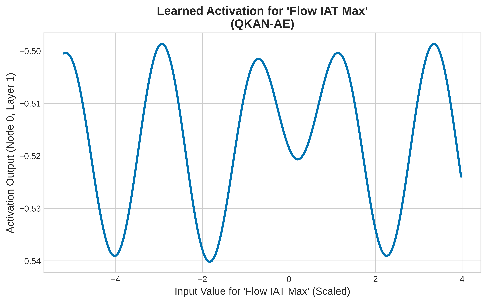

# QKAN-based Intrusion Detection System (IDS)

This project implements an unsupervised anomaly-based Intrusion Detection System (IDS) using a **Quantized Kolmogorov-Arnold Network (QKAN) Autoencoder**. The model is trained on the CIC-IDS-2018 dataset to detect network attacks by identifying deviations from normal traffic patterns.

## Overview

The core of this project is an autoencoder model built with QKAN layers. Autoencoders are trained to reconstruct their input data. In this anomaly detection setup, the model is trained exclusively on "Benign" (normal) network traffic. The hypothesis is that the model will learn to reconstruct normal traffic with low error, but will produce high reconstruction errors when faced with anomalous or malicious traffic. This reconstruction error can then be used as a threshold to flag potential intrusions.

This implementation uses a `QKANAutoencoder` which leverages the theoretical advantages of Kolmogorov-Arnold Networks for potentially more expressive and efficient representation learning compared to traditional MLP-based autoencoders.

## Features

- **Unsupervised Learning**: Detects anomalies without needing labeled attack data during training.
- **Modern Architecture**: Utilizes a Quantized Kolmogorov-Arnold Network (QKAN) for the autoencoder core.
- **Modular Codebase**: Clear separation of concerns for data preprocessing, model definition, training, and evaluation.
- **Scalable Data Processing**: Handles large datasets like CIC-IDS-2018 by processing files in chunks.
- **Robust Preprocessing**: Employs `QuantileTransformer` to normalize features and handle outliers effectively.

## Workflow

The project follows a standard machine learning pipeline:

1.  **Data Preprocessing**: Raw CSV files from the CIC-IDS-2018 dataset are cleaned, normalized, and transformed. This involves:
    - Identifying a common set of features across all data files.
    - Removing irrelevant or constant columns.
    - Applying a `QuantileTransformer` to normalize the feature distributions.
    - Saving the processed data, scaler, and column list for later use.
2.  **Training**: The `QKANAutoencoder` is trained on the preprocessed, benign-only traffic data. The model learns to minimize the Mean Squared Error (MSE) between the input and its own reconstruction. The best model is saved based on validation loss.
3.  **Evaluation**: The trained autoencoder is used to reconstruct both benign and malicious traffic from the test set. The reconstruction errors are calculated, and an Isolation Forest algorithm is then trained on these errors to find an optimal threshold for distinguishing attacks from normal traffic.
4.  **Analysis**: Results and model behavior are analyzed, including generating figures to visualize performance and interpretability.

## Setup and Installation

1.  **Clone the repository:**
    ```bash
    git clone https://github.com/ailabteam/qkan-ids.git
    cd qkan-ids
    ```

2.  **Create a Python virtual environment:**
    ```bash
    python -m venv venv
    source venv/bin/activate  # On Windows, use `venv\Scripts\activate`
    ```

3.  **Install the required dependencies:**
    *Create a `requirements.txt` file with the following content:*
    ```txt
    torch
    pandas
    scikit-learn
    numpy
    tqdm
    joblib
    ```
    *Then, install the packages:*
    ```bash
    pip install -r requirements.txt
    ```

4.  **Download the Dataset**:
    - Download the **CIC-IDS-2018** dataset. A common source is the [University of New Brunswick](https://www.unb.ca/cic/datasets/ids-2018.html).
    - Unzip the dataset files.
    - Place all the `.csv` files into a directory named `cicids2018_data` in the root of the project.

## Usage

Follow these steps to run the full pipeline.

**Step 1: Preprocess the Data**

Run the preprocessing script to clean and transform the raw dataset. This will create a `processed_data` directory containing the normalized data and scaler objects.

```bash
python preprocess_data.py
```

**Step 2: Train the QKAN Autoencoder**

Train the model on the processed benign data. The best performing model will be saved in the `models/` directory.

```bash
python train.py
```

**Step 3: Evaluate the Model**

Once the model is trained, evaluate its performance on the test set. This script calculates reconstruction errors and uses an Isolation Forest to find an anomaly threshold.

```bash
python evaluate.py
```

**Step 4: Analyze Results**

Run the analysis scripts to generate figures and insights from the evaluation results.

```bash
python analyze_processed_data.py
python create_figures.py
```

## Project Structure

```
.
├── cicids2018_data/ # Directory for the raw CIC-IDS-2018 CSV files
├── processed_data/  # Output of the preprocessing script
├── models/          # Saved PyTorch models
├── figures/         # Output for generated plots and figures
│
├── preprocess_data.py # Script to clean and normalize the raw data
├── dataset.py         # PyTorch Dataset and DataLoader classes
├── qkan.py            # (Assumed) Implementation of the QKAN layer/model
├── train.py           # Main script for training the QKAN autoencoder
├── evaluate.py        # Script to evaluate the model and find anomaly thresholds
├── run_isoforest.py   # Helper script for running the Isolation Forest evaluation
├── analyze_processed_data.py # Script for post-evaluation analysis
├── create_figures.py  # Script to generate result visualizations
│
├── README.md          # This file
```

## Results

The model's effectiveness is determined by its ability to separate benign and malicious traffic based on reconstruction error. The `evaluate.py` script outputs metrics such as Precision, Recall, and F1-score.

Visualizations, like the one below, help interpret the model's behavior.



## Contributing

Contributions are welcome! If you have suggestions or improvements, please open an issue or submit a pull request.

1.  Fork the repository.
2.  Create a new branch (`git checkout -b feature/your-feature`).
3.  Commit your changes (`git commit -m 'Add some feature'`).
4.  Push to the branch (`git push origin feature/your-feature`).
5.  Open a pull request.

## License

This project is licensed under the MIT License. See the `LICENSE` file for details.
